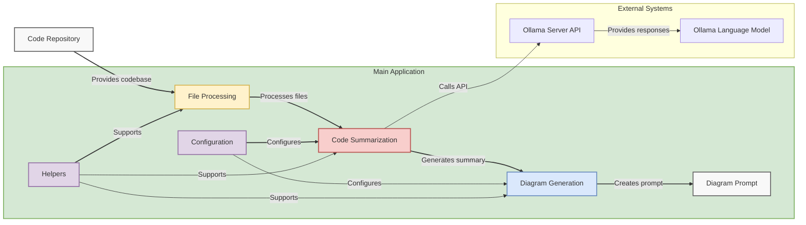

# InsightCode

InsightCode is a tool designed to analyze codebases and provide detailed insights, including code summaries and architecture visualizations. This tool is ideal for gaining an understanding of legacy codebases, aiding in integration, modernization, or test scenario creation. The output can be used to ask questions about the code, generate diagrams, or create documentation.



## Features
- **Automated code summaries**: Get concise, accurate descriptions of code files.
- **Mermaid diagram generation**: Visualize your system architecture in a flowchart format.
- **Output ready for use with LLMs**: Use the generated files to ask questions or feed into AI tools like ChatGPT to gain further insights.

---

## Installation

### 1. Install Python 3.x
Make sure you have Python 3.x installed on your system. You can download it from the official [Python website](https://www.python.org/downloads/).

### 2. Install Ollama for local language model inference
Ollama is required for running models locally.

To install Ollama:
```bash
curl -fsSL https://ollama.com/install.sh | sh
```
After installation, pull the necessary model:
```bash
ollama pull llama3.1:8b-instruct-fp16
```
### 3. Install Python Dependencies
Python dependencies need to be installed:
```bash
pip install -r requirements.txt
```

Note: Make sure you have Tesseract OCR installed on your system for pytesseract to function properly. You may need to configure the Tesseract executable path if it's not in your system's PATH environment variable.

# Preparing Code for Analysis

## Create a repo/ folder:
Place the code you want to analyze inside the repo/ folder. You may want to clean the folder of unnecessary files like binaries, test files, or build artifacts to optimize the analysis process.

## Run the Analysis:
Run the main Python script, and InsightCode will automatically analyze the codebase, generate summaries for each file, and create a Mermaid diagram prompt for visualizing the architecture.

# Output

After running the script, InsightCode generates the following output files in the output/ folder:

## mermaid_prompt.txt

This file contains a structured Mermaid diagram prompt based on the analyzed codebase. You can use this to generate visual diagrams.
To generate a diagram:

Copy the content of mermaid_prompt.txt into ChatGPT or another AI tool and ask it to generate the diagram.
Alternatively, use tools like Visual Studio Code (VSCode) with the Mermaid extension to visualize the diagram.

## codebase_summary.txt

This file contains summaries of the code files analyzed. You can use these summaries to ask AI models questions about the codebase, generate documentation, or even create test scenarios.

# Visualizing the Mermaid Diagram

## Using ChatGPT

- Paste the content of mermaid_prompt.txt in a ChatGPT window and ask it to generate a Mermaid diagram.
- If the file is too large, upload it as an attachment to ChatGPT and request the prompt to be executed.

## Using Visual Studio Code (VSCode)

- Install the Mermaid Markdown Extension in VSCode.
- Create a .md file, paste the Mermaid code between :::mermaid and ::: code blocks, and view the diagram directly in VSCode.

# Usage Tips

- Ask Questions About Code: After the codebase summary is generated, you can paste it into a tool like ChatGPT to ask specific questions about the code's functionality or architecture.
- Generate Test Scenarios: Use the code summaries to generate functional or integration test scenarios for your application.

# License
This project is licensed under the MIT License - see the LICENSE file for details.

Made with ❤️ by the InsightCode team.
